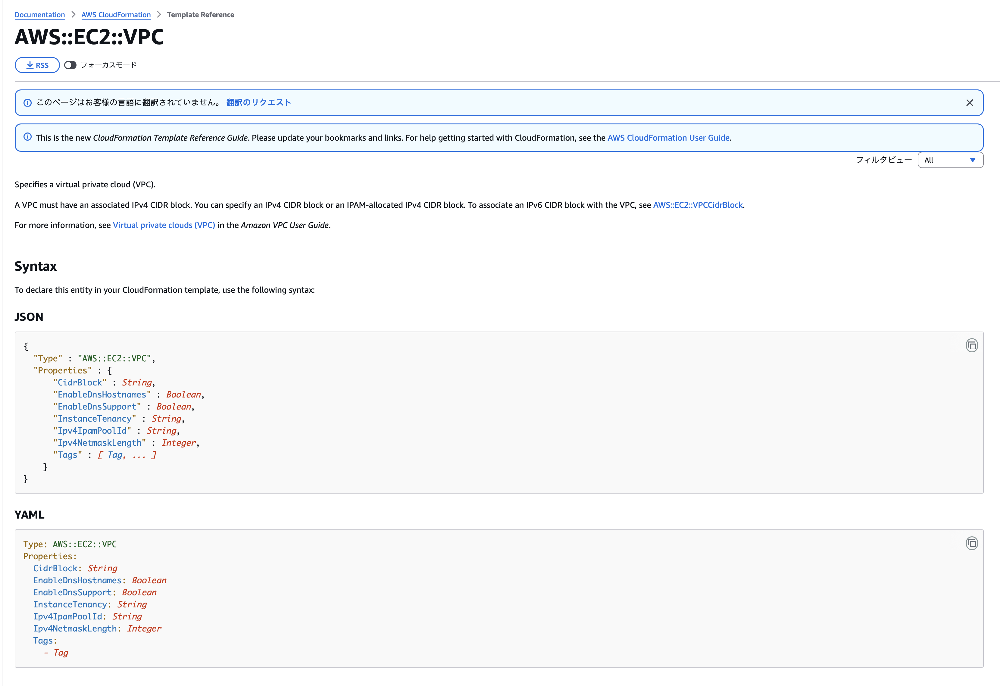

# 第3章 リソース定義の書き方・読み方

## リソース定義の基本構造

CloudFormationテンプレートで最も重要なのが`Resources`セクションです。

Resourceセクションでは前章の通りで、AWSリソースを定義していきます。

基本的な書き方は以下のようになっています。

### 基本的な書き方

```yaml
Resources:
  論理ID:
    Type: リソースタイプ
    Properties:
      プロパティ名: 値
```

### 具体例

```yaml
Resources:
  MyVPC:
    Type: AWS::EC2::VPC
    Properties:
      CidrBlock: 10.0.0.0/16
      EnableDnsHostnames: true
```

## 論理IDと物理IDの違い

CloudFormationでは、リソースに2つのIDが存在します。

### 論理ID（Logical ID）

**テンプレート内でリソースを識別するための名前**です。

```yaml
Resources:
  MyVPC:  # これが論理ID
    Type: AWS::EC2::VPC
```

- テンプレート内で一意である必要があります
- 英数字のみ使用可能です
- 大文字小文字を区別します
- 他のリソースから`!Ref`で参照する際に使います

### 物理ID（Physical ID）

**AWS上で実際に作成されたリソースのID**です。

- CloudFormationが自動的に割り当てます
- `vpc-0123456789abcdef0`のような形式で、皆さんが普段コンソールで見ているIDがこちらに該当します

### 論理IDと物理IDの関係

```yaml
Resources:
  MyVPC:  # 論理ID
    Type: AWS::EC2::VPC
    Properties:
      CidrBlock: 10.0.0.0/16

  MySubnet:
    Type: AWS::EC2::Subnet
    Properties:
      VpcId: !Ref MyVPC  # MyVPCの物理ID（例: vpc-xxx）をよしなに入れてくれる
```

## Resource Typeの考え方

`Type`には、作成するAWSリソースの種類を指定します。

### Resource Typeの形式

```
AWS::サービス名::リソース名
```

### 主な例

| リソース | Type |
|---|---|
| VPC | `AWS::EC2::VPC` |
| Subnet | `AWS::EC2::Subnet` |
| SecurityGroup | `AWS::EC2::SecurityGroup` |
| EC2 Instance | `AWS::EC2::Instance` |
| S3 Bucket | `AWS::S3::Bucket` |
| IAM Role | `AWS::IAM::Role` |
| RDS Instance | `AWS::RDS::DBInstance` |

### Resource Typeの探し方

AWS公式ドキュメントの「[Resource and property types reference](https://docs.aws.amazon.com/AWSCloudFormation/latest/UserGuide/aws-template-resource-type-ref.html)」に全てのリソースタイプが記載されています。

上記リンクから作成したいリソースを選択して、必要なパラメータを記入していきます。



## Propertiesの構造

`Properties`には、リソースの具体的な設定を記述します。

### Propertiesはリソースごとに異なる

当然ですが、VPCとEC2では設定できる項目が全く異なります。

#### VPCの例

```yaml
Resources:
  MyVPC:
    Type: AWS::EC2::VPC
    Properties:
      CidrBlock: 10.0.0.0/16
      EnableDnsHostnames: true
      EnableDnsSupport: true
```

#### EC2の例

```yaml
Resources:
  MyEC2:
    Type: AWS::EC2::Instance
    Properties:
      ImageId: ami-0123456789abcdef0
      InstanceType: t2.micro
      SubnetId: !Ref MySubnet
```

### どのプロパティが必須か？

各リソースには、**必須のプロパティ**と**任意のプロパティ**があります。

AWS公式ドキュメントの各リソースページに記載されています。

例：`AWS::EC2::VPC` の場合

- `CidrBlock` は**必須**
- `EnableDnsHostnames`は任意
- `Tags` は任意

任意となっているものでもユーザ側で設定しない場合、AWS側でよしなに設定されるものがあるので注意して下さい。

## AWS公式ドキュメントの読み方

CloudFormationを使いこなすには、公式ドキュメントを読む力が重要です。

### ドキュメントの構成

各リソースのドキュメントは、以下の構成になっています。

1. **Syntax**：基本的な書き方
2. **Properties**：各プロパティの詳細
3. **Return values**：`!Ref`や`!GetAtt`で取得できる値
4. **Examples**：実際の使用例

### 例：AWS::EC2::VPCのドキュメントを読む

公式ドキュメント: [AWS::EC2::VPC](https://docs.aws.amazon.com/AWSCloudFormation/latest/UserGuide/aws-resource-ec2-vpc.html)

#### 1. Syntax（書き方）

YAML形式での基本的な書き方が示されています。

#### 2. Properties（プロパティ）

各プロパティの詳細が記載されています。

- **Required**：必須かどうか
- **Type**：データ型（String、Booleanなど）
- **Update requires**：更新時の挙動（後述）

#### 3. Return values

`!Ref`で何が返るか、`!GetAtt`でどの属性が取得できるかが記載されています。

例：
- `!Ref MyVPC` → VPCのID（`vpc-xxx`）
- `!GetAtt MyVPC.CidrBlock` → CIDRブロック（`10.0.0.0/16`）

#### 4. Examples

実際の使用例が記載されています。最も参考になる部分です。

## よく使う代表的なリソース

### 1. VPC（Virtual Private Cloud）

AWS上にプライベートネットワーク空間を作成します。

```yaml
Resources:
  MyVPC:
    Type: AWS::EC2::VPC
    Properties:
      CidrBlock: 10.0.0.0/16
      EnableDnsHostnames: true
      EnableDnsSupport: true
      Tags:
        - Key: Name
          Value: my-vpc
```

### 2. Subnet

VPC内にサブネットを作成します。

```yaml
Resources:
  MySubnet:
    Type: AWS::EC2::Subnet
    Properties:
      VpcId: !Ref MyVPC
      CidrBlock: 10.0.1.0/24
      AvailabilityZone: ap-northeast-1a
      MapPublicIpOnLaunch: true
      Tags:
        - Key: Name
          Value: my-subnet
```

### 3. SecurityGroup

セキュリティグループのルールを定義します。

```yaml
Resources:
  MySecurityGroup:
    Type: AWS::EC2::SecurityGroup
    Properties:
      GroupDescription: Web server security group
      VpcId: !Ref MyVPC
      SecurityGroupIngress:
        - IpProtocol: tcp
          FromPort: 80
          ToPort: 80
          CidrIp: 0.0.0.0/0
        - IpProtocol: tcp
          FromPort: 443
          ToPort: 443
          CidrIp: 0.0.0.0/0
      Tags:
        - Key: Name
          Value: my-security-group
```

### 4. IAM Role

AWSサービスに権限を付与するためのロールを定義します。

```yaml
Resources:
  MyIAMRole:
    Type: AWS::IAM::Role
    Properties:
      AssumeRolePolicyDocument:
        Version: '2012-10-17'
        Statement:
          - Effect: Allow
            Principal:
              Service: ec2.amazonaws.com
            Action: sts:AssumeRole
      ManagedPolicyArns:
        - arn:aws:iam::aws:policy/AmazonSSMManagedInstanceCore
      Tags:
        - Key: Name
          Value: my-iam-role
```

## Tagsの付け方

ほとんどのAWSリソースには、`Tags`を設定できます。

### Tagsとは

リソースにメタデータを付与する仕組みです。

- 管理用のラベル
- コスト配分タグ
- 検索・フィルタリング用

### Tagsの書き方

```yaml
Tags:
  - Key: Name
    Value: my-resource
  - Key: Environment
    Value: dev
  - Key: Owner
    Value: team-a
```

### タグの重要性

`Name`タグは、コンソール上での表示名になります。設定することで、リソースの識別が容易になります。

タグをつけておくと特定の時間に停止するリソースの区別などの可能になります。


```yaml
Tags:
  - Key: Name
    Value: !Sub '${EnvironmentName}-vpc'
```

## 次の章へ

リソース定義の基本が理解できたら、[第4章 パラメータ設計と可読性](../chapter04/README.md) に進んでください。

パラメータを使って、テンプレートをより柔軟にする方法を学びます。
